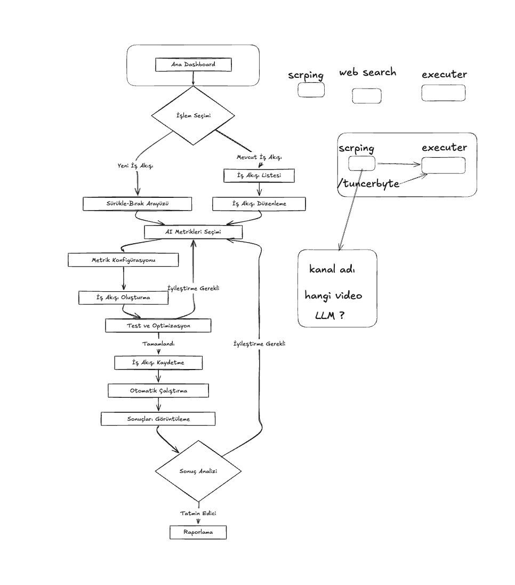

# AI Agent Otomasyon Backend

Bu proje, AI Agent Otomasyon sisteminin backend kısmını içerir. FastAPI kullanılarak geliştirilmiş modern bir API sunucusudur.

## Sistem Tasarımı



## Özellikler

- FastAPI tabanlı modern API
- Asenkron işlem desteği
- AI Agent yönetimi
- WebSocket gerçek zamanlı iletişim
- Modüler agent mimarisi

## Teknolojiler

- Python 3.11+
- FastAPI
- SQLAlchemy
- Pydantic
- OpenAI API
- WebSocket
- Docker

## Kurulum

```bash
# Virtual environment oluşturun
python -m venv venv

# Virtual environment'ı aktifleştirin
source venv/bin/activate  # Linux/Mac
venv\Scripts\activate     # Windows

# Bağımlılıkları yükleyin
pip install -r requirements.txt

# .env dosyasını oluşturun
cp .env.example .env

# Sunucuyu başlatın
uvicorn app.main:app --reload
```

## API Endpoints

- `POST /api/agents/create`: Yeni agent oluşturma
- `GET /api/agents/{agent_id}`: Agent bilgilerini getirme
- `PUT /api/agents/{agent_id}`: Agent güncelleme
- `DELETE /api/agents/{agent_id}`: Agent silme
- `POST /api/agents/{agent_id}/execute`: Agent'ı çalıştırma
- `WS /ws/agents/{agent_id}`: WebSocket bağlantısı

## Agent Tipleri

- Web Scraper Agent
- YouTube Agent
- Code Interpreter Agent
- Data Analysis Agent
- Text Generation Agent
- Image Generation Agent

## Geliştirme

Projeye katkıda bulunmak için:

1. Bu repository'yi fork edin
2. Yeni bir branch oluşturun (`git checkout -b feature/amazing-feature`)
3. Değişikliklerinizi commit edin (`git commit -m 'Add some amazing feature'`)
4. Branch'inizi push edin (`git push origin feature/amazing-feature`)
5. Bir Pull Request oluşturun 